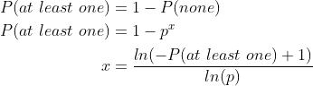

# Limitless Lottery

A simulation game where you are allowed to spend an infinite amount of money on different kinds of lottery tickets. Will you make more than you spend?

# Running

## Running in development

This will only launch the local database. You can now run the app in your IDE and it will connect to the database.

```
docker-compose -f docker-compose.db.yaml up
```

## Running in production

This will build the app to a small Alpine Docker image, and bring up a MongoDB database which communicates with the app.

```
docker-compose -f docker-compose.db.yaml -f docker-compose.yaml up
```

# Probability calculations

<!-- Equations from: https://www.codecogs.com/latex/eqneditor.php -->

## Buying *x* amount of tickets

The calculations that determine how many lottery tickets won out of a certain amount, are calculated using the binomial distribution. This is a way of checking the number of successes in a sequence of n independent experiments. [*more information about binomial distribution*](https://en.wikipedia.org/wiki/Binomial_distribution)

Using this technique I improved the performance of the ticket checking calculations to *O(1)*.

I used the library [gonum](https://www.gonum.org/)’s distuv.Binomial struct, that allowed me to pass in an amount and a probability, and receive a random amount of successes generated using binomial distribution.

## Buying until success (win)

Here I took the formula for at least one success, and modified it so that the input variable is *P(at least one)* (a number from 0 to 1), and the output variable is an amount of successes. 

<!---
\begin{align*}
P(at\ least\ one) &= 1- P(none)\\
P(at\ least\ one) &= 1 - p^x\\
x &= \frac{ln(-P(at\ least\ one) + 1)}{ln(p)}
\end{align*}
-->


The reason why I needed to do this was that I needed a way to introduce randomness into the equation. Now I can insert a random number from 0 to 1 in *P(at least one)*’s place, and get an amount of wins, that reflects an accurate representation of the probability.

# License

This project is licensed under the MIT License - see the [LICENSE](LICENSE) file for details